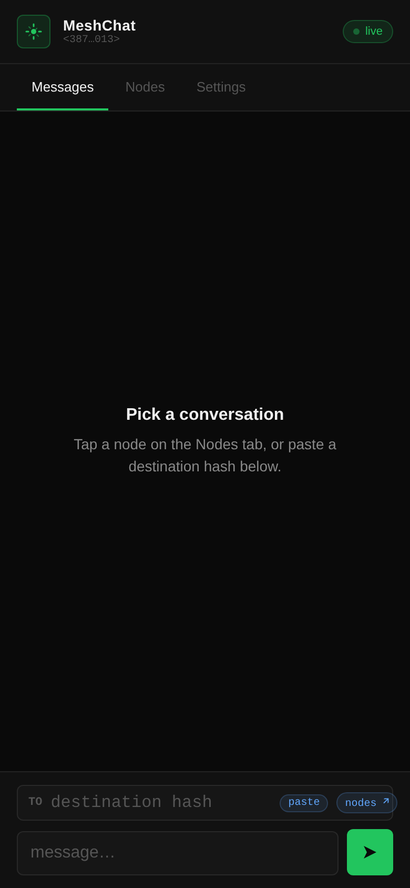
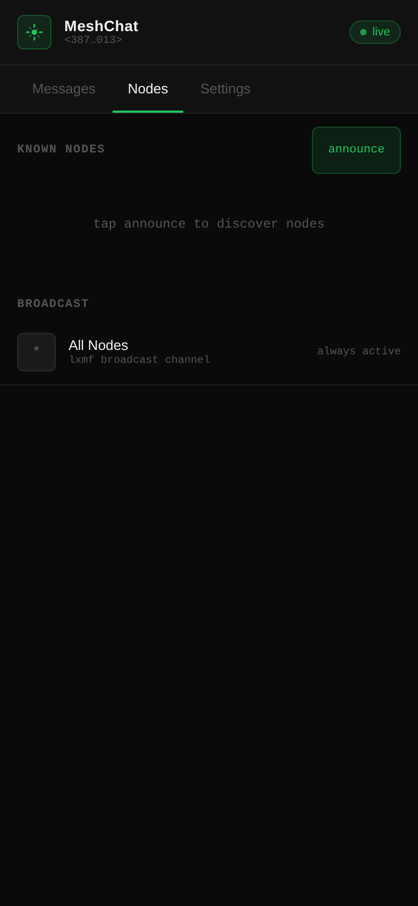
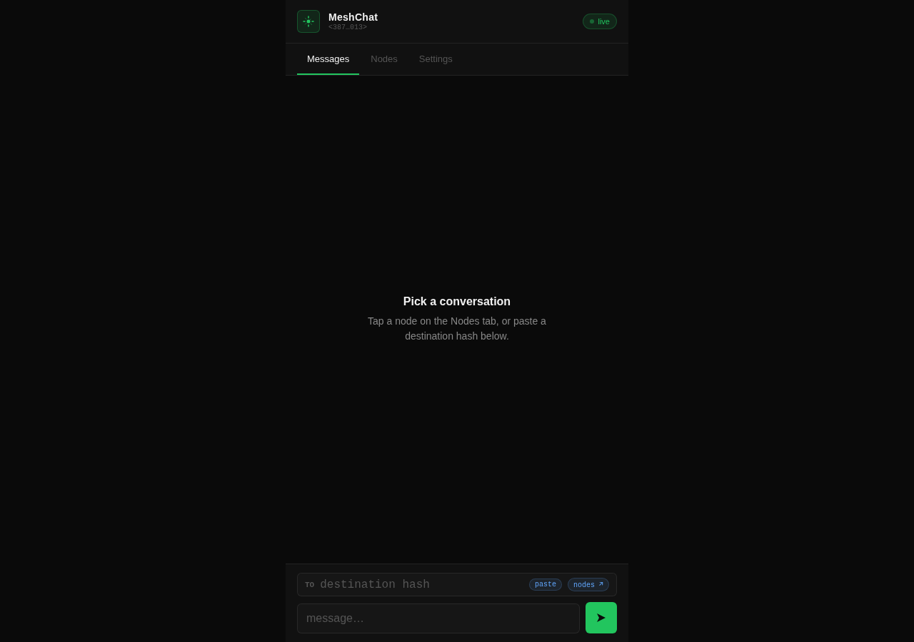
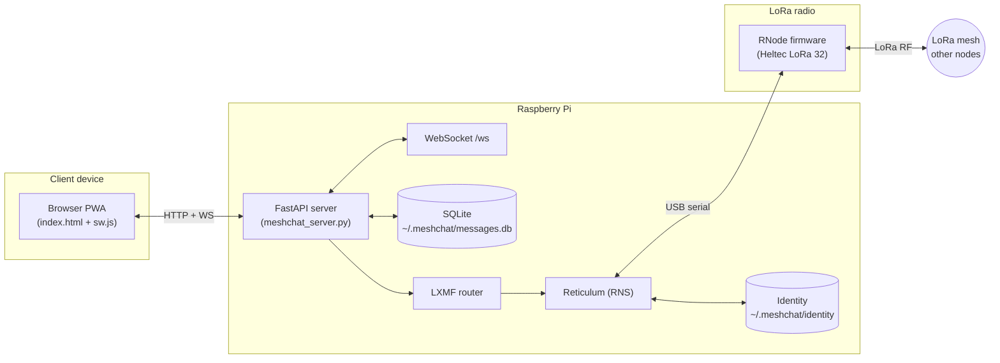
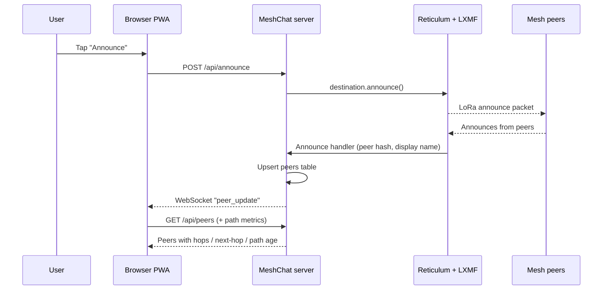
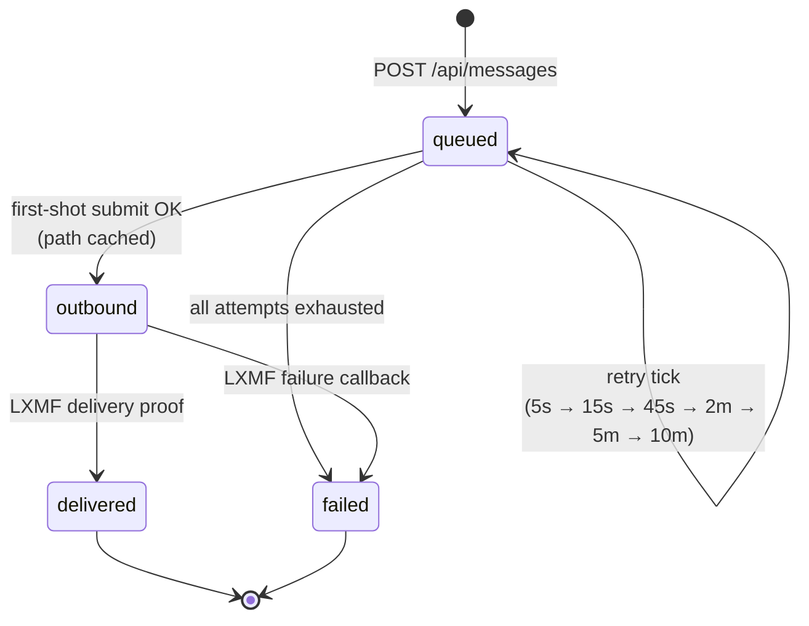

<p align="center">
  
</p>

<h1 align="center">MeshChat</h1>

<p align="center">
  <em>Off-grid LoRa mesh messaging over <a href="https://reticulum.network/">Reticulum</a> — a PWA you can open from any phone browser.</em>
</p>

<p align="center">
  <a href="LICENSE"></a>
  
  
  
  
</p>

---

## Why

Existing Reticulum clients (Sideband, NomadNet) are Android-focused or terminal-based, leaving iPhone users without a great option. MeshChat solves this by running as a Progressive Web App served directly from your Reticulum node. Connect to the node's WiFi from any device with a browser, open the page, and chat over the mesh. No app store, no internet, no account.

## Screenshots

<p align="center">
  
  &nbsp;
  
</p>

<p align="center">
  
</p>

## Architecture

MeshChat runs on a Raspberry Pi (or similar) connected to a LoRa radio. The Pi serves a lightweight web UI over its local network — either its own WiFi Access Point or a shared LAN. Messages ride the [LXMF](https://github.com/markqvist/lxmf) protocol on top of Reticulum's encrypted transport.



- **Frontend** — single-file vanilla-JS PWA (`static/index.html`, `sw.js`, `manifest.json`). Tab-based UI (Messages / Nodes / Settings), WebSocket push with polling fallback, optimistic send with live status.
- **Backend** — FastAPI app (`meshchat_server.py`) that bridges REST + WebSocket to LXMF. All endpoints async; DB and RNS work offloaded to executors.
- **Storage** — SQLite at `~/.meshchat/messages.db` (messages, peers, schema version) plus a persistent Reticulum `identity` and LXMF inbox.
- **Protocol** — Reticulum for routing and encryption; LXMF for addressed messaging with `direct`, `opportunistic`, and `propagated` delivery modes.

### Peer discovery and announce flow



### Delivery state machine

Every outbound message moves through the same status graph. The server retries with exponential back-off while the path to the destination resolves.



If the path is unknown at send time, the API returns **`202 path_requested`** and the retry worker takes over. When an incoming announce resolves the path, the queued message is submitted on the next tick.

## Hardware

Tested on:

- **Raspberry Pi 4B** running Pi OS Lite (headless)
- **Heltec LoRa 32** connected over USB, flashed with [RNode firmware](https://github.com/markqvist/RNode_Firmware)
- A LoRa antenna matched to your frequency band
- Pi configured as a **WiFi Access Point** so clients can connect without existing infrastructure

Any hardware supported by Reticulum should work — the Pi plus RNode combo is just what's been proven.

## Quick Start

### 1. Install dependencies

```bash
python -m venv rns-venv
source rns-venv/bin/activate
pip install -r requirements.txt
```

### 2. Configure Reticulum

Make sure Reticulum can see your LoRa interface. See the [Reticulum manual](https://markqvist.github.io/Reticulum/manual/) for interface setup. A typical `~/.reticulum/config` contains a serial interface entry for the RNode plus any IP/TCP interfaces you want to bridge.

### 3. Run MeshChat

```bash
python meshchat_server.py
```

The server binds to `0.0.0.0:8080`. Open `http://<pi-ip>:8080` from any device on the network.

### 4. Use it

- Open the URL in your phone's browser
- Tap **Add to Home Screen** for a native-app feel (PWA install)
- Set your display name in **Settings**
- Paste or scan a destination hash and start messaging

All user data lives in `~/.meshchat/` — wipe that directory to reset identity and history.

## Configuration

MeshChat reads configuration from environment variables prefixed with `MESHCHAT_` or from a `.env` file next to `meshchat_server.py` (via [pydantic-settings](https://docs.pydantic.dev/latest/concepts/pydantic_settings/)).

| Variable | Default | Purpose |
|---|---|---|
| `MESHCHAT_HOST` | `0.0.0.0` | Bind address |
| `MESHCHAT_PORT` | `8080` | HTTP port |
| `MESHCHAT_DATA_DIR` | `~/.meshchat` | SQLite + identity + LXMF storage |
| `MESHCHAT_STATIC_DIR` | `./static` | Served static assets |
| `MESHCHAT_PEER_REPLY_COOLDOWN` | `3600` s | Minimum gap between auto-replies to the same peer |
| `MESHCHAT_PEER_REPLY_MEMORY` | `86400` s | How long to remember recent auto-replies |
| `MESHCHAT_RNS_RETRY_INTERVAL` | `30` s | Reticulum startup retry cadence |
| `MESHCHAT_QUEUED_RETRY_DELAYS` | `(5,15,45,120,300,600)` | Per-attempt delay schedule for queued outbound messages |
| `MESHCHAT_QUEUED_RETRY_TICK` | `5` s | Retry worker tick interval |
| `MESHCHAT_DEST_CACHE_TTL` | `3600` s | LXMF destination cache lifetime |
| `MESHCHAT_INTERFACES_BROADCAST_INTERVAL` | `10` s | How often interface snapshots are pushed over WS |
| `MESHCHAT_WS_PING_INTERVAL` | `30` s | Idle WebSocket keepalive |

Example `.env`:

```dotenv
MESHCHAT_PORT=9000
MESHCHAT_DATA_DIR=/var/lib/meshchat
MESHCHAT_QUEUED_RETRY_DELAYS=(10,30,90,300)
```

### LXMF delivery options

`POST /api/messages` accepts a `method` field that maps directly onto the LXMF delivery modes:

| Method | When to use | Behaviour |
|---|---|---|
| `direct` | Peer is reachable now and you want an explicit link | Establishes a direct link before transfer |
| `opportunistic` *(default)* | Normal short messages | Fire-and-forget; LXMF picks the best path |
| `propagated` | Recipient may be offline or out of range | Hands the message to a propagation node for store-and-forward |

Propagation nodes are configured at runtime via `PUT /api/propagation_nodes` or the Settings screen. Outbound (the node your messages are handed to) and inbound (the node your client polls for stored messages) are set independently; either can be cleared with `null` or an empty string.

## Running as a Service

Run MeshChat under systemd so it starts on boot.

### 1. Create the service file

```bash
sudo nano /etc/systemd/system/meshchat.service
```

Paste the following (replace `USERNAME` and the paths as needed):

```ini
[Unit]
Description=MeshChat LoRa mesh web server
After=network.target

[Service]
Type=simple
User=USERNAME
WorkingDirectory=/home/USERNAME/meshchat
ExecStart=/home/USERNAME/meshchat/rns-venv/bin/python meshchat_server.py
Restart=on-failure
RestartSec=5
StandardOutput=journal
StandardError=journal

[Install]
WantedBy=multi-user.target
```

### 2. Enable and start it

```bash
sudo systemctl daemon-reload
sudo systemctl enable --now meshchat
sudo systemctl status meshchat   # should show active (running)
journalctl -u meshchat -f        # follow logs
```

App-level events log under the `[meshchat]` prefix; Reticulum/LXMF protocol events use `RNS.log` and appear alongside.

## API

| Method | Path | Description |
|---|---|---|
| `GET` | `/api/identity` | Node hash, display name, and RNS-ready status |
| `GET` | `/api/messages?limit=N` | Message history (newest first) |
| `POST` | `/api/messages` | Send a message: `{to, body, method?}`; returns **202 `path_requested`** if the path is unknown |
| `PUT` | `/api/display_name` | Update the local display name |
| `PUT` | `/api/wifi_ssid` | Persist the configured WiFi SSID (informational) |
| `POST` | `/api/announce` | Broadcast node presence over all interfaces |
| `GET` | `/api/peers` | Discovered peers with hops, next-hop, and path age |
| `DELETE` | `/api/peers/{hash}` | Remove a peer |
| `GET` | `/api/interfaces` | Snapshot of active Reticulum interfaces |
| `GET` | `/api/propagation_nodes` | Current outbound/inbound propagation-node hashes |
| `PUT` | `/api/propagation_nodes` | Set or clear propagation nodes (either role optional) |
| `WS` | `/ws` | Real-time push: messages, status updates, peer events, interface snapshots |

Requests that need Reticulum are gated by a `require_rns_ready` dependency and will return **503** until the RNS stack has come up.

## Development

- See [`AGENTS.md`](AGENTS.md) for the session workflow used in this repo — `bd` (beads) for issue tracking, landing-the-plane checklist for commits.
- There is no build step and no test framework — the app is four files served directly.
- Deployments to lab nodes (`node1`, `node2`) are one-shot rsyncs; see `.claude/commands/deploy-node1.md` and `deploy-node2.md` (ignored locally).

## License

[MIT](LICENSE)
